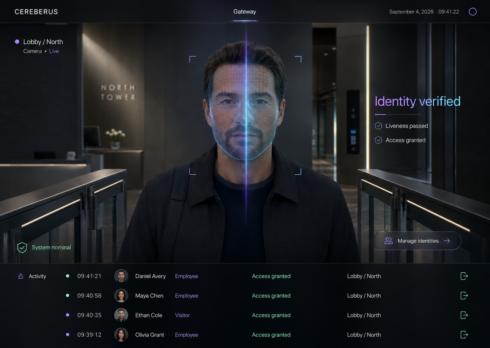

# Cereberus

A local-first, face-gated access-control prototype with blink-based liveness verification, guided identity enrollment, an operator console, and an inspectable access log.



## Why this project exists

Cereberus explores the full interaction around a biometric gate—not only face matching. It separates the recognition engine from the operator interface and makes every decision visible through clear system states, confidence information, health diagnostics, and an audit trail.

## Implemented flow

1. The browser captures a camera frame.
2. The local Python service detects and matches the first visible face.
3. A matched identity must complete a blink challenge.
4. The engine returns one of five explicit states:
   - `NO_FACE`
   - `SCANNING`
   - `VERIFIED`
   - `DENIED`
   - `SPOOF_SUSPECTED`
5. Decisions are logged locally. Denied and suspected-spoof attempts can store a snapshot.

## Features

- Five-sample guided identity enrollment
- Local face embeddings and recognition
- Blink-based liveness challenge
- One-decision-per-attempt state handling
- Operator console with live status and safe demo mode
- Runtime health and threshold diagnostics
- CSV event history with denied-entry snapshots
- Unit coverage for storage, engine states, and web endpoints

## Stack

- Python
- OpenCV
- `face_recognition`
- NumPy
- React and Vite

## Run locally

### Backend

```bash
python -m venv .venv
# Windows: .venv\Scripts\activate
# macOS/Linux: source .venv/bin/activate
pip install -r requirements.txt
```

### Frontend and integrated console

```bash
cd frontend
npm ci
npm run build
cd ..
python -m src.web
```

Open [http://127.0.0.1:8765](http://127.0.0.1:8765).

For visual development, keep the Python service running and use `npm run dev` inside `frontend/`; Vite proxies API requests to port 8765.

## Enroll an identity

```bash
python -m src.enroll "Name"
```

Follow the camera prompts and capture five samples. Stored embeddings are created locally.

## Test

```bash
python -m unittest discover -s tests
```

## Configuration

Recognition threshold, eye-aspect-ratio threshold, liveness timeout, storage paths, and logging paths are centralized in `src/config.py`.

## Security and privacy boundary

Cereberus is a prototype, not a production physical-access system.

- Biometric processing and stored embeddings remain local.
- Blink detection is a lightweight challenge and is not robust protection against sophisticated presentation attacks.
- The engine currently processes one person at a time and uses the first detected face.
- A real deployment would require trained anti-spoofing, encrypted biometric storage, authenticated administration, retention controls, adversarial testing, and hardware relay safeguards.
